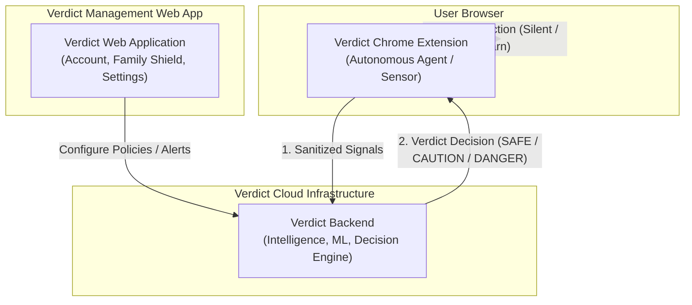

# Verdict

**Verdict** is an autonomous browser safety and security product designed with a single core philosophy:

> **"The user should never have to think."**

Verdict acts as an invisible safety layer during daily web browsing. It observes contextual risk signals, sanitizes and normalizes them, communicates with the central Verdict Decision Engine, and takes silent or gentle action only when necessary.

---

## System Architecture

The complete Verdict product consists of three coordinated subsystems:



### Component Breakdown

1. **`extension/` (Chrome Extension)**:
   - Autonomous browser agent and sensor.
   - Observes browser and page lifecycle events.
   - Collects minimal structural metadata (no passwords, card numbers, or raw HTML).
   - Sanitizes and transmits telemetry to the decision engine.
   - Enforces decisions via silent continuation or unobtrusive, accessible warning overlays.
   
2. **`backend/` (Verdict Backend)**:
   - Owns intelligence, brand impersonation detection, ML models, threat databases, and decision generation.
   
3. **`web/` (Verdict Web Application)**:
   - Manages user account, protection history, devices, Family Shield, and policy configurations.

4. **`console/` (Verdict Operator Console)**:
   - Dedicated internal operator interface for monitoring sandboxing sessions, queues, ML heuristics, and system telemetry.

---

## Monorepo Layout

```
verdict/
├── extension/          # Chrome Extension Manifest V3 source and tests
├── web/                # Verdict Web Application
├── backend/            # Verdict Intelligence Backend
├── console/            # Verdict Operator Console
├── docs/               # Architecture and security specifications
├── .github/workflows/  # CI/CD pipelines
├── .gitignore          # Root git ignore
└── README.md           # This document
```

---

## Quick Start (Extension)

To develop and test the extension locally:

```bash
cd extension
npm install
npm run dev
```

To build and package for distribution:

```bash
cd extension
npm run build
npm run package
```

Refer to [`extension/README.md`](file:///d:/BCA/Verdict/extension/README.md) for full developer documentation.
