# Verdict Master Operator Console

> Mission-control operations dashboard for real-time monitoring of autonomous website investigations, sandbox telemetry, payment forensics, brand impersonation analysis, and AI reasoning.

---

## 1. Purpose & Flow

Verdict Console is the internal mission-control system for monitoring autonomous website investigation workflows triggered by the browser extension.

### End-to-End Investigation Flow

```mermaid
graph LR
    A[Browser Extension] -->|URL Received| B[Fast Intelligence]
    B --> C[Sandbox Dispatch]
    C --> D[Behavioral Analysis]
    D --> E[Payment Forensics]
    E --> F[Brand & Content]
    F --> G[Evidence Aggregation]
    G --> H[AI Investigator]
    H --> I[Decision Policy]
    I -->|Verdict: SAFE / CAUTION / DANGER| J[Extension Response]
```


---

## 2. 10 Operational Modules & Pages

1. **OVERVIEW**: System throughput, active queue, sandbox worker load, verdict distribution (`SAFE`/`CAUTION`/`DANGER`), avg latency, and live event stream.
2. **INVESTIGATIONS**: Complete searchable, filterable registry of all URLs ingested with status, stage, threat score, latency, and deep-dive actions.
3. **INVESTIGATION DETAIL** *(Core Page)*: Live 10-stage autonomous pipeline workflow (`URL_RECEIVED` $\rightarrow$ `EXTENSION_RESPONSE`) with interactive stage evidence drawers.
4. **SANDBOX MONITOR**: Headless container runtime session monitor, network waterfall with sensitive data redaction, script execution hooks, captured forms, popups, and behavioral flag timeline.
5. **PAYMENT FORENSICS**: Detection and verification of payment methods, client SDKs, secure iframes, checkout redirect chains, raw credit card harvest traps, and crypto checkout flags (`VERIFIED` / `SUSPICIOUS` / `UNVERIFIED` / `NOT_DETECTED`).
6. **WEBSITE & DOMAIN INTEL**: WHOIS registration data, domain age, TLS cryptographic certificate chains, business entity verification, and domain/business inconsistency checks.
7. **BRAND & CONTENT**: Claimed vs detected brand lookalike comparison, official domain mismatch checks, Levenshtein typo-squatting distance, visual asset similarity, copied boilerplates, and weak AI-generated copy confidence metrics.
8. **AI INVESTIGATOR**: Inspectable evidence-based reasoning, conflicting signals resolution matrix (benign vs malicious interpretations), risk factor weights, and plain-English operator briefing.
9. **VERDICT DECISION**: Final policy classification (`SAFE`/`CAUTION`/`DANGER`), rule trigger matrix evaluation (e.g. `POL-CRIT-01`), primary reasons, and browser extension enforcement payload.
10. **SYSTEM HEALTH**: Cluster telemetry, sandbox runner node pool capacity, P95/P99 latency distributions, service health statuses, and real-time operational logs.

---

## 3. Architecture & Data Flow

```
console/src/
├── types/                # Domain models (Investigation, Sandbox, Payment, Brand, AI, Verdict, Events)
├── utils/                # Security redaction (redactSensitiveText, redactHeaders) & formatters
├── services/
│   ├── apiClient.ts      # API client & data layer adapter
│   ├── eventStream.ts    # Real-time event streaming bus & pipeline simulator
│   └── mockData.ts       # Deterministic realistic threat & enterprise datasets
├── context/
│   └── ConsoleContext.tsx # React state provider managing active investigation & event feed
├── components/
│   ├── navigation/       # Sidebar & Top Header
│   ├── pipeline/         # 10-stage progression track & StageEvidenceDrawer
│   └── common/           # RiskGauge, StatusBadge, TelemetryStream, etc.
├── pages/                # 10 modular operational mission-control screens
└── styles/               # High-density dark security operations styling
```

---

## 4. Real-Time Event Architecture

The console is reactive and updates live from a typed event stream:

- `REQUEST_RECEIVED`
- `ANALYSIS_STARTED`
- `SIGNALS_COLLECTED`
- `SANDBOX_STARTED`
- `SANDBOX_EVENT`
- `PAYMENT_DETECTED`
- `BRAND_DETECTED`
- `ANALYSIS_COMPLETED`
- `AI_ANALYSIS_STARTED`
- `AI_ANALYSIS_COMPLETED`
- `VERDICT_GENERATED`
- `EXTENSION_NOTIFIED`
- `REQUEST_FAILED`

### Future WebSocket / SSE Integration
The `EventStreamService` in `src/services/eventStream.ts` is architected to subscribe directly to backend Server-Sent Events (`/v1/stream/events`) or WebSockets (`wss://backend/events`), dispatching updates straight into `ConsoleContext`.

---

## 5. Security & Sensitive Data Redaction

All network requests, forms, and DOM inspection views apply `src/utils/redact.ts`:
- **Credit Card Numbers**: Luhn matches masked to `•••• •••• •••• 4242`.
- **Passwords / PINs**: Replaced with `••••••••`.
- **Auth Tokens & JWTs**: Replaced with `Bearer [REDACTED_AUTH_TOKEN]` and `[REDACTED_JWT_SIGNATURE]`.
- **Session Cookies**: Automatically stripped from headers.

---

## 6. Development & Verification

```bash
# Start local development server
npm run dev

# Run TypeScript type checking (Zero errors)
npm run typecheck

# Run ESLint (Zero warnings)
npm run lint

# Run Vitest test suite (9/9 passed)
npm run test

# Build production bundle
npm run build
```
